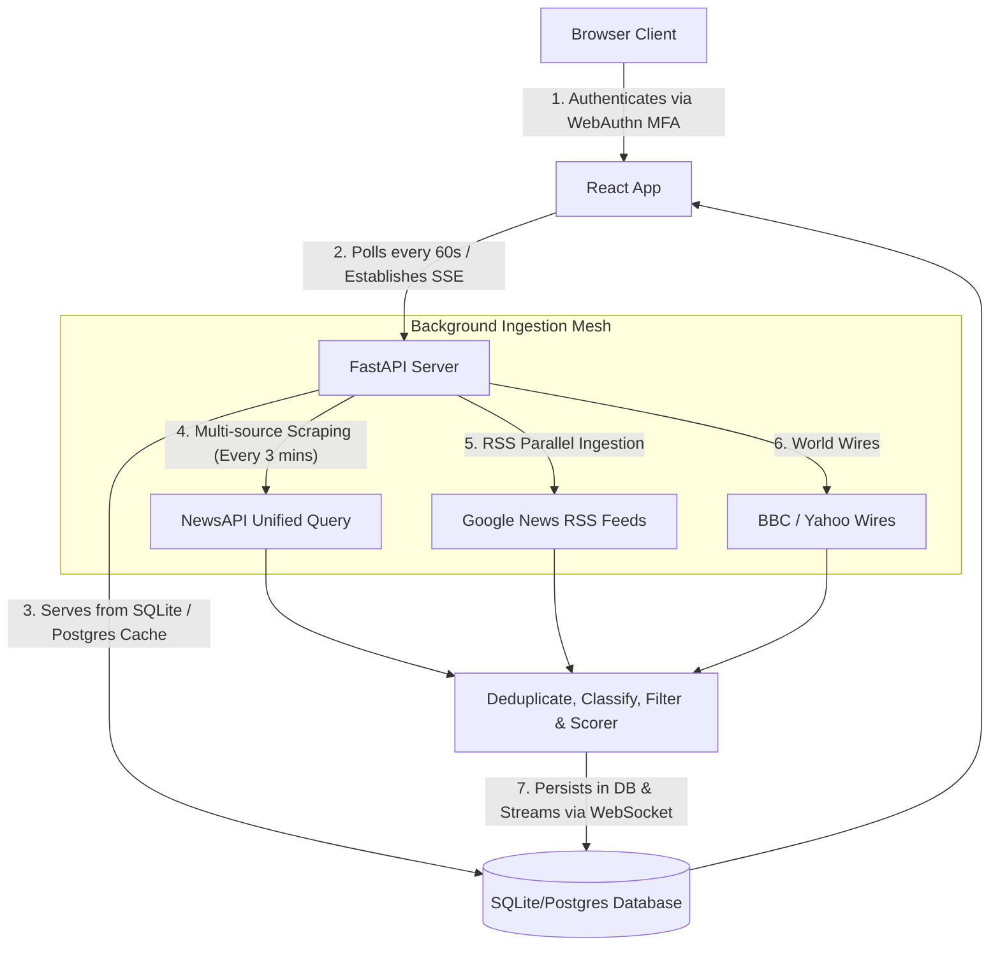

# Drishya

A high-performance news and tactical telemetry intelligence dashboard monitoring India's border sectors in real-time. Built with a FastAPI ingestion mesh, SQLite fallback database, and a React/TypeScript/Vite frontend.

---

## 1. System Architecture

The application is structured as a decoupled web application comprising:
1. **FastAPI Ingestion Backend**: A Python backend that aggregates geopolitical border signals from NewsAPI, RSS feeds, and global wire sources, serving them via REST and WebSockets.
2. **React/TypeScript Frontend**: A visual telemetry dashboard styled with CSS and Material Symbols, displaying dossiers, interactive gauges, and real-time alerts.
3. **Docker Compose Deployment**: Backend, frontend, PostgreSQL with pgvector, and Redis services are orchestrated together for reproducible local deployment.



---

## 2. Key Features

- **OSINT Tactical Intelligence Chatbot**: Replaced file uploading with an interactive scrolling chatbot. Query border alerts, trade deals, and troop movements in real-time. Supports markdown parsing (bold and hyperlinks) and lists reference news card links directly under responses.
- **Unified Ingestion & High Density**: Consolidates news queries into unified API searches, saving 90% key quota. The ingestion pipeline scrapes up to **500 raw articles** per sweep cycle (up to 50 articles per border country) to guarantee high-fidelity operational signals.
- **Abundant News Feeds**: In order to prevent empty dashboard displays, the query lookup is set to 30 days and the frontend dynamically merges recent events with matching older historical articles, maintaining a rich, populated dossier (15-30 articles) at all times.
- **Precise Classification Matching**: Uses standalone word boundaries (`\b...s?\b`) inside the classification regex engine to ensure zero false positive match collisions on common English terms (e.g. word *sports* matching *port*, *said* matching *aid*).
- **Local LLM Synthesis (Ollama)**: Natively supports local Ollama API queries (using `llama3.1:8b-instruct`) for chatbot summaries and executive briefings, falling back to local rule-based Markdown synthesis only when the local model is offline.
- **Automated Test Suite**: Equipped with a comprehensive unittest suite validating database connections, classification rules, summarizer heuristics, and FastAPI endpoint routes.

---

## 3. Installation & Setup Instructions

### Prerequisites
- Node.js (v18 or higher)
- Python (3.11 or higher)
- npm

### Installation
1. Clone the repository:
   ```bash
   git clone https://github.com/Seekay/globalive.git
   cd globalive
   ```
2. Install dependencies:
   ```bash
   npm install
   pip install -r backend/requirements.txt
   ```
3. Set up credentials in the `.env` file at the project root:
   ```env
   NEWS_API_KEY=your_news_api_key_here
   LLM_PROVIDER=ollama
   LLM_MODEL=llama3.1:8b-instruct
   OLLAMA_BASE_URL=http://127.0.0.1:11434
   ```

### Local LLM Setup (Ollama)
1. Install Ollama locally from https://ollama.com.
2. Pull the default open-weight model:
   ```bash
   ollama pull llama3.1:8b-instruct
   ```
3. Keep Ollama running locally (default endpoint: `http://127.0.0.1:11434`).
If Ollama is unavailable, the backend automatically falls back to offline semantic summaries so the interface remains fully functional.

### Running Locally
To launch both the backend server (port 3001) and frontend dev server (port 3000) concurrently:
```bash
npm run dev
```

### Running Tests
To execute the automated Python backend unit and integration test suite:
```bash
python -m unittest backend/tests/test_all.py
```

### Production Build
To build and bundle the project files:
```bash
npm run build
```
The compiled assets can be served statically by the backend in Docker or by the frontend Nginx container.

### Render Deployment
This repository includes a `render.yaml` configuration for Render.com.
- Use the `Dockerfile.backend` service in Render to build both the frontend and backend assets in one container.
- Set `DATABASE_URL` and `REDIS_URL` using Render managed services.
- Deploy with the start command:
  ```bash
  sh -c "uvicorn backend.app.main:app --host 0.0.0.0 --port ${PORT:-3001}"
  ```
Render deployment uses the backend service to serve the React app assets and API from the same container. The routing structure is optimized to ensure static files do not shadow backend API endpoints.
