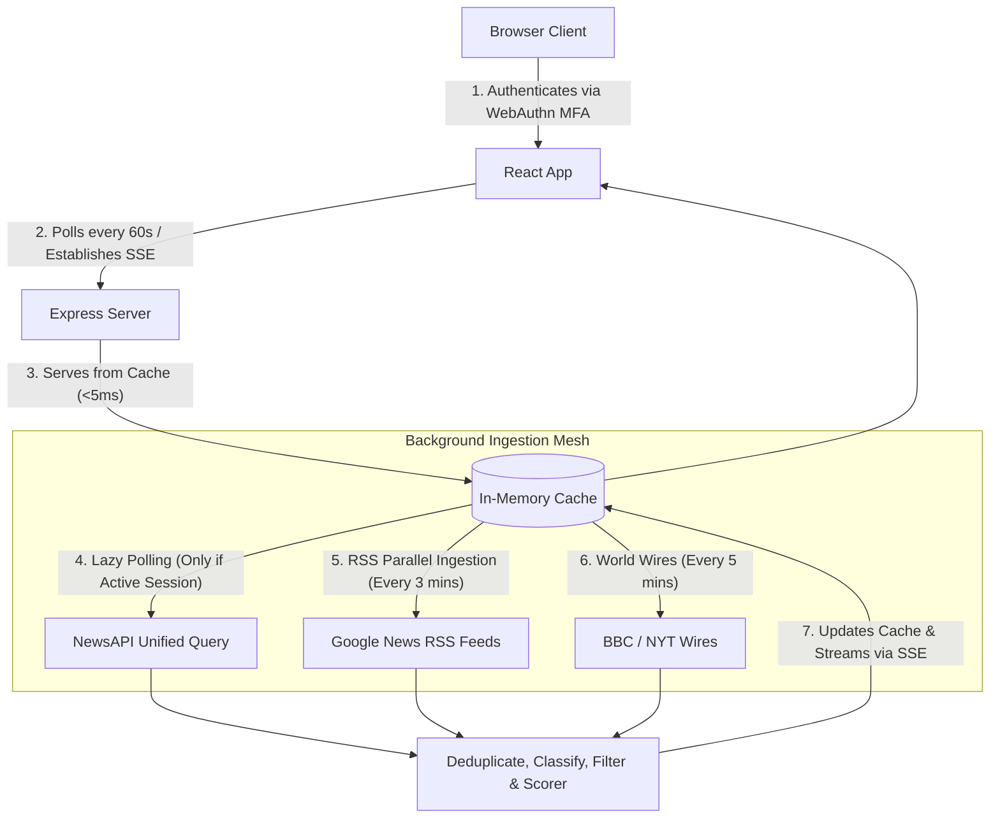

# Drishya

A high-performance news and tactical telemetry intelligence dashboard monitoring India's border sectors in real-time. Built and maintained by Seekay with a Node/Express ingestion mesh and a React/TypeScript/Vite frontend.

---

## 1. System Architecture

The application is structured as a decoupled web application comprising:
1. **Express Ingestion Backend**: A background caching poller that aggregates geopolitical border signals from NewsAPI and multilingual Google News RSS feeds, serving them via REST and Server-Sent Events (SSE).
2. **React/TypeScript Frontend**: A visual telemetry dashboard styled with CSS and Material Symbols, displaying dossiers, interactive gauges, and real-time alerts.



---

## 2. Key Features

- **Unified Ingestion & Quota Preservation**: Consolidates news queries into a single query to NewsAPI, reducing key quota consumption by 90%.
- **Lazy Session Polling**: Automatically pauses NewsAPI scraper calls when there is no active client activity, preventing rate-limit exhaustion.
- **Multilingual RSS Ingestion**: Parses English, Chinese, and Urdu RSS feeds for all 9 borders concurrently using parallel promises.
- **Local Classification Engine**: Maps, scores, and categorizes articles into `Military`, `Tech`, `Political`, `Economic`, and `Social` categories.
- **Grounded AI Search**: Optional online model-backed query answers that summarize trusted public reporting and return cited source links.
- **SSE Real-Time Stream**: Streams breaking geopolitical signals instantly. Interleaves high-fidelity simulated telemetry sweeps to maintain operational visual flow during silent periods.
- **Tactical Keyboard Navigation**: Fully keyboard-navigable (`j`/`k` cursors, `Enter` to open split preview, `Esc` to close, `/` to focus search coordinates).
- **WebAuthn Authenticator Gate**: Secure simulated biometric access control gate.

---

## 3. Installation & Setup Instructions

### Prerequisites
- Node.js (v18 or higher)
- npm

### Installation
1. Clone the repository:
   ```bash
   git clone https://github.com/Seekay/globalive.git
   cd globalive
   ```
2. Install dependencies:
   ```bash
   npm install
   ```
3. Set up credentials in the `.env` file at the project root:
   ```env
   NEWS_API_KEY=your_news_api_key_here
   HF_API_KEY=your_huggingface_api_key_here
   HF_MODEL=google/flan-t5-large
   ```

### AI Search Notes
- The search overlay can use an optional Hugging Face hosted model for source-grounded news answers.
- If `HF_API_KEY` is not set, the app falls back to its built-in extractive answer generator.
- The AI search is restricted to public-news summarization and refuses operational or tactical planning requests.

### Running Locally
To launch both the backend server (port 3001) and frontend dev server (port 3000) concurrently:
```bash
npm run dev
```

### Production Build
To build and bundle the project files:
```bash
npm run build
```
The compiled assets will be served statically by the Express backend.
