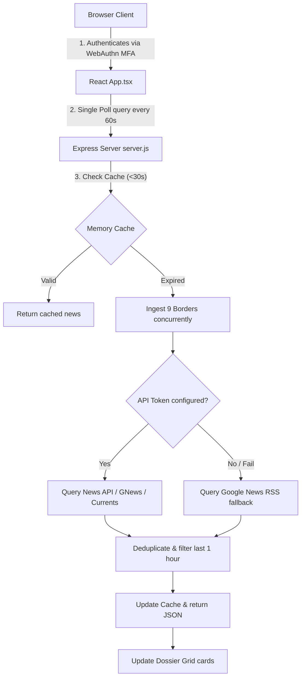

# Operational System Report - Geospatial Hub (STRATCOM-ALPHA)

This report details the system architecture, code organization, data ingestion pipeline, and runtime capabilities of the **Geospatial Hub (STRATCOM-ALPHA) India Border Intelligence Dashboard** (Current Version).

---

## 1. System Architecture

The dashboard is structured as a decoupled web application comprising a high-performance Express ingestion backend and a real-time React/Vite single-page frontend.



### A. Frontend Layer (React + TypeScript + Vite)
*   **View Layer**: Compiled using **Vite** for rapid hot-reloading and modular builds.
*   **Styling Engine**: Styled using **Tailwind CSS** coupled with **Material Symbols Outlined** for visual telemetry.
*   **State & Sync Management**: 
    *   Tracks the selected country dossier (monitoring China, Pakistan, Afghanistan, Bangladesh, Myanmar, Nepal, Bhutan, Sri Lanka, and the Maldives).
    *   Fires a single concurrent API request (`/api/news/all`) every **60 seconds**.
    *   Maintains a depleting linear progress bar (0%–100%) showing countdown telemetry to the next sync.

### B. Backend Ingestion Layer (Node.js + Express)
*   **Server Framework**: Express handles routing, JSON payloads, and static file deliveries.
*   **Cachability (Rate-Limit Protection)**: A 30-second server-side memory cache acts as a buffer. Frequently refreshed client views query this cache instead of calling external APIs, ensuring free key quotas aren't exhausted.
*   **Mesh API Fallback Chain**: Queries news providers in priority order:
    1.  **NewsAPI.org** (`NEWS_API_KEY`)
    2.  **GNews.io** (`GNEWS_API_KEY`)
    3.  **Currents API** (`CURRENTS_API_KEY`)
    4.  **TheNewsAPI** (`THENEWS_API_KEY`)
    5.  **Mediastack** (`MEDIASTACK_API_KEY`)
    6.  **Newscatcher** (`NEWSCATCHER_API_KEY`)
    7.  **Bing News Search** (`BING_NEWS_API_KEY`)
    8.  **Google News RSS** (Universal Fallback, parsing feeds via `rss-parser`)

---

## 2. Ingestion & Noise Filtering Engine

To ensure raw OSINT feeds match strict intelligence criteria, the backend executes three processing filters:

1.  **Noise/Clickbait Filter**: Rejects articles containing keywords associated with quizzes, trivia, stock market price alerts, sports contests, or unrelated entertainment news.
2.  **Normalized Deduplication**: Normalizes article headlines (lowercasing, removing non-alphanumeric characters, and truncating to a 35-character hash) and rejects duplicates.
3.  **Strict 1-Hour Temporal Filter**: Discards articles older than 1 hour. If the resulting feed is empty, it marks the country's summary with `"STATUS: STABLE // NO NEW SIGNAL IN DETECTED WINDOW"`.

---

## 3. Directory Structure

The project code is organized as follows:

```text
Dashboard/
├── .env                  # API Credentials (NewsAPI.org & GNews key configured)
├── package.json          # Node dependencies (express, rss-parser, concurrently, react, vite)
├── index.html            # Main HTML document (Tailwind CSS, fonts, and Material icons)
├── server/
│   └── server.js         # Express routes, cache manager, scraping API chain & filters
└── src/
    ├── main.tsx          # React application mounting entry point
    ├── App.tsx           # WebAuthn Login Gate, Dossier Grid View, sidebar country dossiers
    └── styles.css        # Shimmer effects, scanline animations, and marquee alert ticker
```

---

## 4. Key UI Widgets & User Flow

*   **Security Access Gate (MFA Simulation)**:
    Authenticates via user emails (`analyst@intel.local`, `operator@intel.local`, `admin@intel.local`) and credentials. Clicking the fingerprint visual launches a simulated WebAuthn cryptographic handshake, authenticating user sessions.
*   **Dossier Grid Landing View**:
    *   **Neighbor Dossiers (Sidebar)**: Renders the active country list with green glowing indicators showing which borders have active signals in the last hour.
    *   **Thematic News Cards**: 5 panels representing `Political`, `Social`, `Tech`, `Economic`, and `Military` streams. If active news is found, it renders article headings, descriptions, and source tags directly inside the card. If empty, the card displays a fallback briefing.
    *   **UAV Production & Stability Gauges**: Interactive visual bars displaying local drone output volumes, security stability indices, and risk probabilities.
    *   **Marquee Warning Ticker**: Displays running classification details and system alerts at the bottom of the screen.
